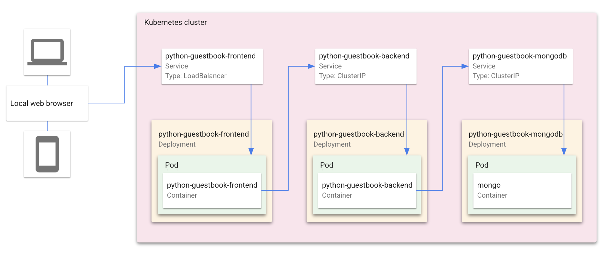

# Demo with Gemini

There are couple of documents to help using Gemini and playing with it.

* [Adding Gemini Code Assist](./GEMINI.md) to help you add Gemini to Visual Studio Code.
* [Remote `minikube`](./REMOTE_MINIKUBE.md) shows you how to have `minikube` running remotely and accessing locally.
* [Running the code locally](./LOCAL_RUN.md) shows you how to run all without Docker or minikube for debugging and testing.
* [Some Gemini prompts to try](./PROMPTS_TO_TRY.md) how to go from the vanilla example to what you see here.

## Repository QR

# Guestbook with Cloud Code

The Guestbook sample demonstrates how to deploy a Kubernetes application with a front end service and a back end service using the Cloud Code IDE extension.  

For details on how to use this sample as a template in Cloud Code, read the documentation for Cloud Code for [VS Code](https://cloud.google.com/code/docs/vscode/quickstart-local-dev?utm_source=ext&utm_medium=partner&utm_campaign=CDR_kri_gcp_cloudcodereadmes_012521&utm_content=-) or [IntelliJ](https://cloud.google.com/code/docs/intellij/quickstart-k8s?utm_source=ext&utm_medium=partner&utm_campaign=CDR_kri_gcp_cloudcodereadmes_012521&utm_content=-).

### Table of Contents
* [What's in this sample](#whats-in-this-sample)
* [Getting Started with VS Code](#getting-started-with-vs-code)
* [Getting Started with IntelliJ](#getting-started-with-intellij)
* [Sign up for User Research](#sign-up-for-user-research)

---
## What's in this sample
### Kubernetes architecture

### Directory contents

- `skaffold.yaml` - A schema file that defines skaffold configurations ([skaffold.yaml reference](https://skaffold.dev/docs/references/yaml/))
- `kubernetes-manifests/` - Contains Kubernetes YAML files for the Guestbook services and deployments, including:

  - `guestbook-frontend.deployment.yaml` - deploys a pod with the frontend container image
  - `guestbook-frontend.service.yaml` - creates a load balancer and exposes the frontend service on an external IP in the cluster
  - `guestbook-backend.deployment.yaml` - deploys a pod with the backend container image
  - `guestbook-backend.service.yaml` - exposes the backend service on an internal IP in the cluster
  - `guestbook-mongodb.deployment.yaml` - deploys a pod containing a MongoDB instance
  - `guestbook-mongodb.service.yaml` - exposes the MongoDB service on an internal IP in the cluster

---
## Getting Started with VS Code

### Run the app locally with minikube

1. To run your application, click on the Cloud Code status bar and select ‘Run on Kubernetes’.  

2. Select ‘Run locally using minikube’ when prompted. Cloud Code runs your app in a local [minikube](https://minikube.sigs.k8s.io/docs/start/) cluster.  

3. View the build progress in the OUTPUT window. Once the build has finished, click on the front end service's URL in the OUTPUT window to view your live application.  

4.  To stop the application, click the stop icon on the Debug Toolbar.

---

## Getting Started with IntelliJ

### Run the app locally with minikube

#### Edit run configuration
1. Click the configuration dropdown in the top taskbar and then click **Edit Configurations**.

   The **Develop on Kubernetes** configuration watches for changes, then uses [skaffold](https://skaffold.dev/docs/) to rebuild and rerun your app. You can customize your deployment by making changes to this run configuration or by creating a new Cloud Code: Kubernetes run configuration.

3. Under **Run > Deployment**, select 'Deploy locally to a minikube cluster'.

4. Click **OK** to save your configuration. 

#### Run the app on minikube
1. Select **Develop on Kubernetes** from the configuration dropdown and click the run icon. Cloud Code runs your app in a local [minikube](ttps://minikube.sigs.k8s.io/docs/start/) cluster.  

2. View the build process in the output window. When the deployment is successful, you're notified that new service URLs are available. Click the Service URLs tab to view the URL(s), then click the URL link to open your browser with your running application.  

3. To stop the application, click the stop icon next to the configuration dropdown.

---
## Sign up for User Research

We want to hear your feedback!

The Cloud Code team is inviting our user community to sign-up to participate in Google User Experience Research. 

If you’re invited to join a study, you may try out a new product or tell us what you think about the products you use every day. At this time, Google is only sending invitations for upcoming remote studies. Once a study is complete, you’ll receive a token of thanks for your participation such as a gift card or some Google swag. 

[Sign up using this link](https://google.qualtrics.com/jfe/form/SV_4Me7SiMewdvVYhL?reserved=1&utm_source=In-product&Q_Language=en&utm_medium=own_prd&utm_campaign=Q1&productTag=clou&campaignDate=January2021&referral_code=UXbT481079) and answer a few questions about yourself, as this will help our research team match you to studies that are a great fit.
